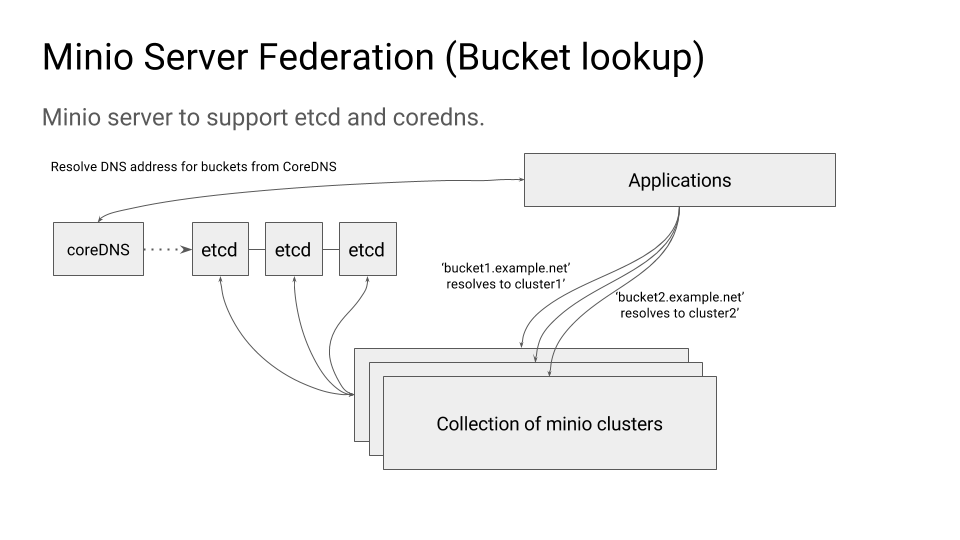

# Federation
There are primarily two types of federation

- Bucket lookup from DNS
- Bucket is shared across many clusters

This document will explain in detail about how to configure Minio supporting `Bucket lookup`

## Federation (Bucket Lookup)
Bucket lookup federation requires two dependencies

- etcd (for config, bucket SRV records)
- coredns (for DNS management based on populated bucket SRV records)

## Architecture



### Run Multiple Clusters
> cluster1
```
export MINIO_ETCD_ENDPOINTS="http://remote-etcd1:2379,http://remote-etcd2:4001"
export MINIO_DOMAIN=domain.com
export MINIO_PUBLIC_IP=44.35.2.1
minio server http://rack{1...4}.host{1...4}.domain.com/mnt/export{1...32}
```
> cluster2
```
export MINIO_ETCD_ENDPOINTS="http://remote-etcd1:2379,http://remote-etcd2:4001"
export MINIO_DOMAIN=domain.com
export MINIO_PUBLIC_IP=44.35.2.2
minio server http://rack{5...8}.host{5...8}.domain.com/mnt/export{1...32}
```

In this configuration you can see `MINIO_ETCD_ENDPOINTS` points to the etcd backend which manages Minio's
`config.json` and bucket SRV records. `MINIO_DOMAIN` indicates the domain suffix for the bucket which
will be used to resolve bucket from DNS. For example if you have a bucket such as `mybucket`, the
client can use now `mybucket.domain.com` to directly resolve to the right cluster. `MINIO_PUBLIC_IP`
points to the public IP address where each cluster might be accessible, this is unique per each cluster.

NOTE: `mybucket` only exists on one cluster either `cluster1` or `cluster2` this is truly random and
is decided by how `domain.com` gets resolved, if there is a round-robin DNS on `domain.com` then
it is truly random which cluster might provision the bucket. This control is not provided to the
client yet, but can be done based on the `region` parameter as supported by `AWS S3` specification.


